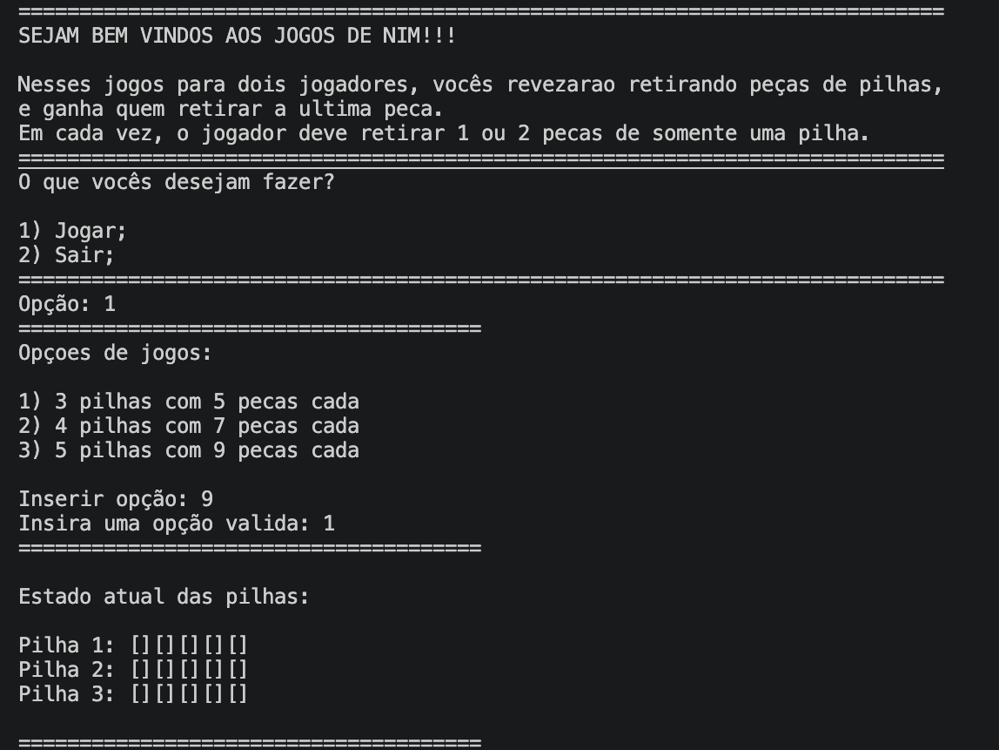
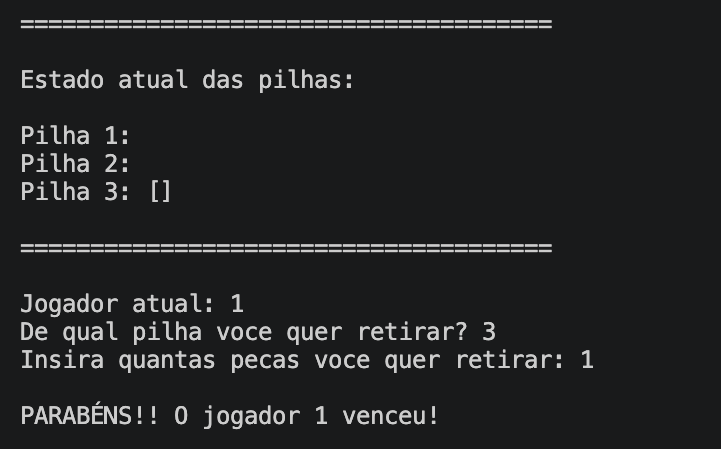

# jogos-de-nim

### Descrição

Os jogos de Nim são clássicos jogos matemáticos que consistem em retirar peças de pilhas. Nesse programa, temos 3 opções de jogo: 3 pilhas com 5 peças cada; 4 pilhas com 7 peças cada e 5 pilhas com 9 peças cada. Os dois jogadores revezam escolhendo uma das pilhas disponíveis e retirando 1 ou 2 peças dela até não sobrarem mais peças. Quem não puder mais tirar peças, perde. Após cada jogada, as pilhas são atualizadas e exibidas aos usuários, além de que o programa verifica vitórias e quando alguém vence, é exibida uma mensagem de parabéns e o jogo é reiniciado. O programa também verifica entradas inválidas, pedindo novamente até ser inserida uma entrada válida. 

### Capturas de tela

<p align="center">
  
  
</p>

### Instalação e Pré-requisitos

Para compilar o projeto, é necessário ter um compilador C++ compatível com o comando `g++` instalado no sistema.

### macOS

No macOS, instale o Xcode Command Line Tools:

```bash
xcode-select --install
```

### Windows

No Windows, uma opção é instalar o **MSYS2**, que fornece o ambiente e as ferramentas necessárias para utilizar o `g++`.

Após instalar o MSYS2, abra o terminal **MSYS2 UCRT64** e instale o compilador:

```bash
pacman -S mingw-w64-ucrt-x86_64-gcc
```
### Linux

Em distribuições baseadas em **Debian/Ubuntu**, instale o compilador C++ com:

```bash
sudo apt update
sudo apt install g++
```

Em distribuições baseadas em **Fedora**, use:

```bash
sudo dnf install gcc-c++
```

Em outras distribuições Linux, consulte o gerenciador de pacotes da sua distribuição para instalar o pacote que fornece o `g++`.

Depois da instalação (independente do sistema) verifique se o compilador está disponível:

```bash
g++ --version
```

Com o `g++` instalado e disponível no terminal, siga as instruções abaixo para compilar e executar o programa.


1. No terminal, digite:

    ```
    git clone https://github.com/elfisicoooo/jogos-de-nim
    cd jogos-de-nim
    ```

2. Após isso, compile com:

    ```
    g++ main.cpp -o jogos-de-nim
    ```

3. Por fim, rode com:

     Windows:
    ```
    jogos-de-nim.exe
    ```

    Linux/macOS:
    ```
    ./jogos-de-nim
    ```

### Usos e exemplos

Ao rodar o programa, é exibido um menu com as opções (1) jogar e (2) sair. Se for escolhida a opção 2, o programa exibe uma mensagem de despedida. Se for escolhida a 1, o programa agora exibe um menu com os 3 modelos de jogo. 

A partir daí, começa o jogo. Em cada rodada, é perguntado ao usuário da vez de qual pilha ele quer retirar peças e em seguida, quantas peças quer retirar. Caso ele insira entradas inválidas (como uma pilha inexistente ou uma quantidade de peças diferente de 1 ou 2), o programa insiste até ser inserida uma opção válida.

Quando o jogo acaba, é exibida uma mensagem de parabéns ao jogador vencedor e o menu inicial é exibido novamente, permitindo aos jogadores a opção de jogar quantas vezes eles quiserem.

### Estrutura do projeto

```
jogos-de-nim/  
│── main.cpp
│── LICENSE 
│── README.md  
└── demonstracoes/  
    ├── dem1.png 
    └── dem2.png  
```

O arquivo main.cpp contém todo o código do jogo, LICENSE apresenta a licença e o diretório demonstracoes/ contém imagens de exemplos do uso do programa.

### Licença  

Este projeto está licenciado sob a MIT License - veja o arquivo [LICENSE](LICENSE) para mais detalhes.  
